# [📈 Live Status](https://up.eka.monster): <!--live status--> **🟧 Partial outage**

This repository contains the open-source uptime monitor and status page for [eka.monster](https://eka.monster), powered by [Upptime](https://github.com/upptime/upptime).

With [Upptime](https://upptime.js.org), you can get your own unlimited and free uptime monitor and status page, powered entirely by a GitHub repository. We use [Issues](https://github.com/demonsteru/up/issues) as incident reports, [Actions](https://github.com/demonsteru/up/actions) as uptime monitors, and [Pages](https://up.eka.monster) for the status page.

<!--start: status pages-->
<!-- This summary is generated by Upptime (https://github.com/upptime/upptime) -->
<!-- Do not edit this manually, your changes will be overwritten -->
<!-- prettier-ignore -->
| URL | Status | History | Response Time | Uptime |
| --- | ------ | ------- | ------------- | ------ |
|  [Libreddit](https://lr.eka.monster) | 🟥 Down | [libreddit.yml](https://github.com/demonsteru/up/commits/HEAD/history/libreddit.yml) | 

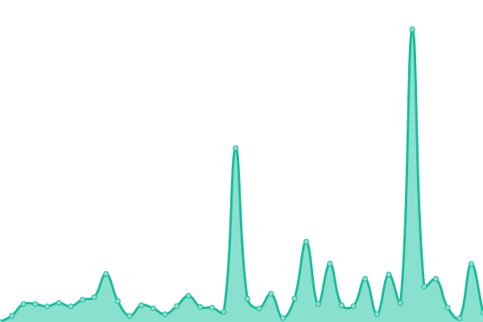 0ms
     
 | 

<a href="https://up.eka.monster/history/libreddit">0.00%</a>
    

|  [YTMous](https://ytmous.eka.monster) | 🟥 Down | [yt-mous.yml](https://github.com/demonsteru/up/commits/HEAD/history/yt-mous.yml) | 

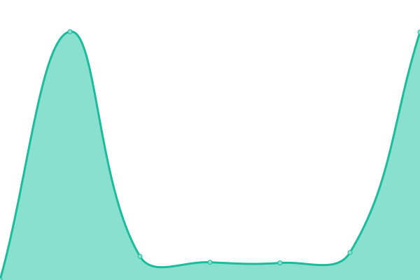 417ms
     
 | 

<a href="https://up.eka.monster/history/yt-mous">0.00%</a>
    

|  [Hastebin](https://haste.eka.monster) | 🟥 Down | [hastebin.yml](https://github.com/demonsteru/up/commits/HEAD/history/hastebin.yml) | 

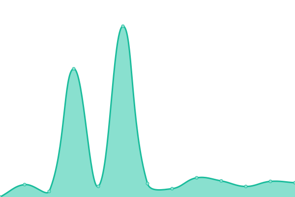 318ms
     
 | 

<a href="https://up.eka.monster/history/hastebin">0.00%</a>
    

|  [PrivateBin](https://bin.eka.monster) | 🟥 Down | [private-bin.yml](https://github.com/demonsteru/up/commits/HEAD/history/private-bin.yml) | 

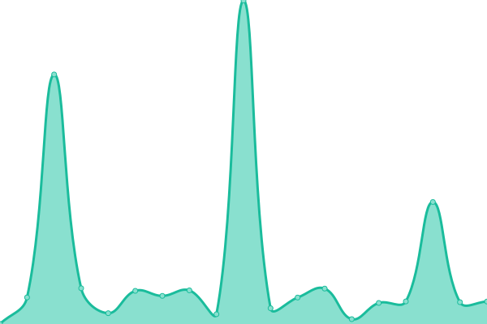 337ms
     
 | 

<a href="https://up.eka.monster/history/private-bin">0.00%</a>
    

|  [StatPing](https://stat.eka.monster) | 🟥 Down | [stat-ping.yml](https://github.com/demonsteru/up/commits/HEAD/history/stat-ping.yml) | 

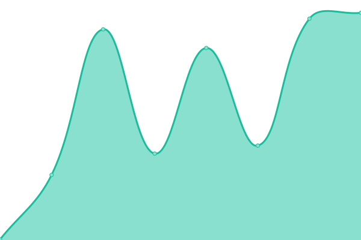 377ms
     
 | 

<a href="https://up.eka.monster/history/stat-ping">0.00%</a>
    

|  [LibreX](https://librex.eka.monster) | 🟥 Down | [libre-x.yml](https://github.com/demonsteru/up/commits/HEAD/history/libre-x.yml) | 

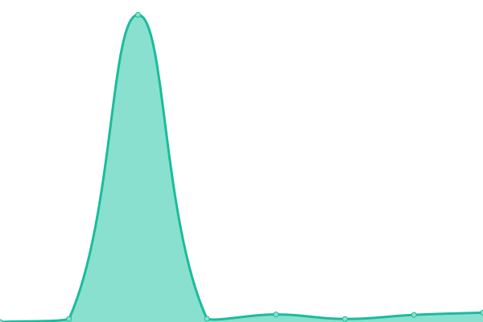 312ms
     
 | 

<a href="https://up.eka.monster/history/libre-x">0.00%</a>
    

|  [SearxNG](https://sx.eka.monster) | 🟩 Up | [searx-ng.yml](https://github.com/demonsteru/up/commits/HEAD/history/searx-ng.yml) | 

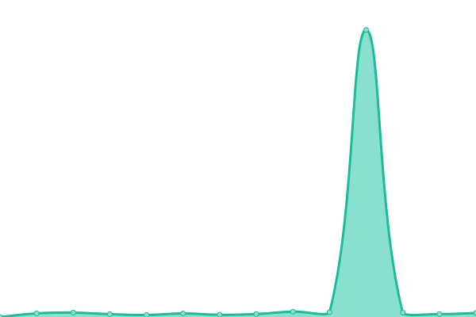 4281ms
     
 | 

<a href="https://up.eka.monster/history/searx-ng">99.24%</a>
    

|  [SearxNG II](https://sng.eka.monster) | 🟩 Up | [searx-ng-ii.yml](https://github.com/demonsteru/up/commits/HEAD/history/searx-ng-ii.yml) | 

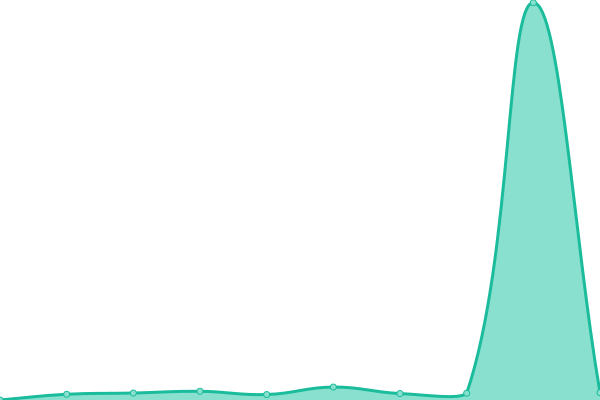 5798ms
     
 | 

<a href="https://up.eka.monster/history/searx-ng-ii">99.61%</a>
    

|  [SearxNG III](https://sx3.eka.monster) | 🟩 Up | [searx-ng-iii.yml](https://github.com/demonsteru/up/commits/HEAD/history/searx-ng-iii.yml) | 

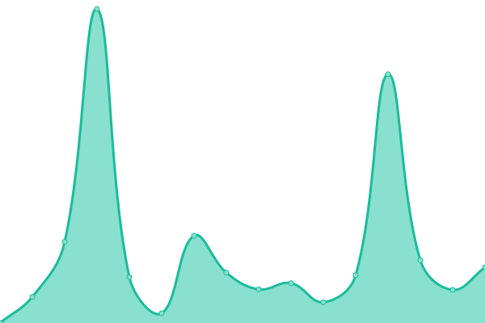 3870ms
     
 | 

<a href="https://up.eka.monster/history/searx-ng-iii">99.37%</a>
    

|  [Whoogle Poko](https://wg.poko.dob.jp) | 🟩 Up | [whoogle-poko.yml](https://github.com/demonsteru/up/commits/HEAD/history/whoogle-poko.yml) | 

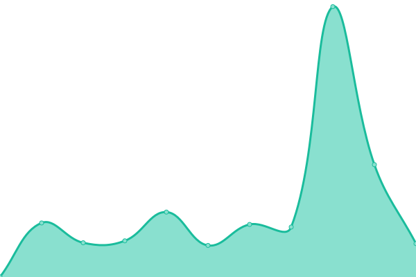 3323ms
     
 | 

<a href="https://up.eka.monster/history/whoogle-poko">99.61%</a>
    

|  [SearxNG Poko](https://sx.poko.dob.jp) | 🟩 Up | [searx-ng-poko.yml](https://github.com/demonsteru/up/commits/HEAD/history/searx-ng-poko.yml) | 

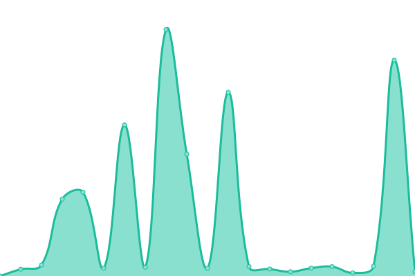 2895ms
     
 | 

<a href="https://up.eka.monster/history/searx-ng-poko">99.24%</a>
    

<!--end: status pages-->

[**Visit our status website →**](https://up.eka.monster)

## 📄 License

- Powered by: [Upptime](https://github.com/upptime/upptime)
- Code: [MIT](./LICENSE) © [eka.monster](https://eka.monster)
- Data in the `./history` directory: [Open Database License](https://opendatacommons.org/licenses/odbl/1-0/)
